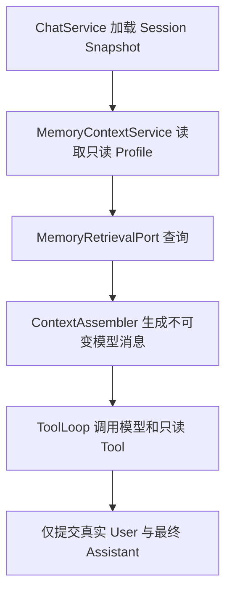

# 只读 Context/Memory 纵向切片设计

- 状态：已实现并验证
- 批准日期：2026-07-14
- 日期：2026-07-14
- 阶段：R4.1
- Contract：[只读上下文与记忆兼容契约](../contracts/read-only-context-memory.md)
- Python 参考 Commit：`b65a5430e332c8733b981dfc2dfbc3eb1967e9ef`

## 1. 目标与范围

实现一个默认关闭、只读、可由 Golden 验证的 Context/Memory 纵向切片：从固定 Markdown Profile 读取，到 Application 组装 System Section 和临时 Context Frame，再到现有 Tool Loop、最终回答与 SQLite 原子提交。

R4.1 不实现真实语义检索引擎。它先固定 Retrieval Port 和注入闭环，避免未来语义记忆、MCP 或 Plugin 直接改写模型消息和循环控制权。

## 2. Python 基准结论

2026-07-14 对 Python Commit `b65a5430e332c8733b981dfc2dfbc3eb1967e9ef` 执行 `tests/test_agent_core_p3_context_store.py` 与 `tests/test_agent_core_p4_prompt_block.py`，10 个测试全部通过。生产实现显示：

- Prompt Block priority 的共同子集为 `self_model(30)`、`long_term_memory(35)`、`recent_context(45)`、`retrieved_memory(55)`。
- `self_model` 与 `long_term_memory` 留在 System Prompt。
- `recent_context` 与 `retrieved_memory` 被移到临时 User Context Frame。
- Frame 位于历史之后、当前 User 之前。
- `RECENT_CONTEXT.md` 的 `Recent Turns` 段不进入该 Section。
- Retrieval Engine 缺失时返回空块；Retrieval Request 使用完整历史，由 Pipeline 自行选择窗口。

## 3. 模块设计

### 3.1 `agent-kernel`

新增纯 JDK 协议：

- `MemoryProfilePort`：读取 Self、Long Term、Recent Context。
- `MemoryRetrievalPort`：只读 Query。
- `MemoryRetrievalRequest`：当前消息、Session Binding、完整历史、时间。
- `MemoryRetrievalResult`：注入块和最小安全 Trace。
- `MemoryRuntimeMode`：`DISABLED`、`READ_ONLY`。

协议不包含 `Path`、Spring、JDBC、Embedding SDK 或 Python 类型。

### 3.2 `agent-application`

新增：

- `ContextAssembler`：按契约组合基础 Prompt、Profile Section、历史、Frame 和当前 User。
- `MemoryContextService`：读取 Profile、调用 Retrieval Port、执行上限与稳定失败转换。
- `NoOpMemoryProfilePort`、`NoOpMemoryRetrievalPort`：默认关闭的空实现。

`ChatService` 在取得 Session Snapshot 后、调用 `ToolLoop` 前构建一次不可变上下文。Tool Loop 不知道文件、Retrieval Engine 或 Section 来源。

### 3.3 `adapter-workspace`

新增只读 `MarkdownMemoryProfileAdapter`：

- 只访问配置 Workspace 下三个固定文件。
- 不创建目录或文件。
- 严格 UTF-8 和普通文件检查。
- 防止符号链接逃逸。
- 在 Adapter 边界执行字节上限。

该模块只依赖 `agent-kernel` 和 JDK NIO，不依赖 Spring。

### 3.4 `agent-bootstrap`

新增 `agent.memory` 配置：

| 配置 | 环境变量 | 默认值 |
| --- | --- | --- |
| `agent.memory.mode` | `AGENT_MEMORY_MODE` | `DISABLED` |
| `agent.memory.max-file-bytes` | `AGENT_MEMORY_MAX_FILE_BYTES` | `65536` |
| `agent.memory.max-context-characters` | `AGENT_MEMORY_MAX_CONTEXT_CHARACTERS` | `100000` |
| `agent.memory.max-retrieved-characters` | `AGENT_MEMORY_MAX_RETRIEVED_CHARACTERS` | `20000` |

`READ_ONLY` 只装配 Markdown Profile Adapter；Retrieval 仍为 NoOp。模板、本地部署和默认配置不自动读取现有 Workspace。

## 4. 调用与提交边界

任何 Profile/检索错误发生在模型调用之前。失败时不调用模型、不执行 Tool、不提交 Conversation。Context Frame 只存在于 `messages` 临时副本中。

## 5. 异常与隐私

新增稳定 Application 错误 `MemoryContextUnavailableException`，公开 HTTP 沿用安全 `502`，不区分文件不存在以外的具体路径、权限、编码、逃逸、超限或 Retrieval 故障。

文件缺失和 Engine 未配置不是异常，分别投影为空 Profile/空 Retrieval。日志只记录稳定错误码和 Request ID，不记录 Session 原文、路径、查询、记忆正文或检索块。

## 6. TDD 与兼容策略

- 行为任务先写聚焦 RED，再实现最小 GREEN。
- Golden 生成器调用 Python 生产 Prompt Block/Assembler；验收资产不人为破坏实现。
- Markdown Adapter 测试只使用 JUnit 临时目录。
- 不读取相邻 Python 仓库的真实 Workspace，也不运行真实模型。
- 阶段门禁集中执行 Spotless、默认 Reactor、`failure`、`compat`、Kernel 依赖和 Secret/Workspace 扫描。

## 7. 后续阶段

R4.1 完成后，R4.2 再单独冻结：

1. Python `MemoryQuery`、Scope、Filter、Result/Trace 共同投影。
2. 语义记忆 Store、Embedding 和 Retrieval Adapter。
3. Embedding、排序、阈值、时间与 Scope 规则。
4. Context Budget、Token 估算和 Trim/Retry。

后续数据决定已明确不迁移旧 Python `memory2.db`；R4.2 改为 Java 原生 Store 与显式管理 API，详见新版 R4.2 Contract。自动写入、Consolidation、Optimizer、Memory Tool 和真实用户数据演练继续留在独立阶段。
