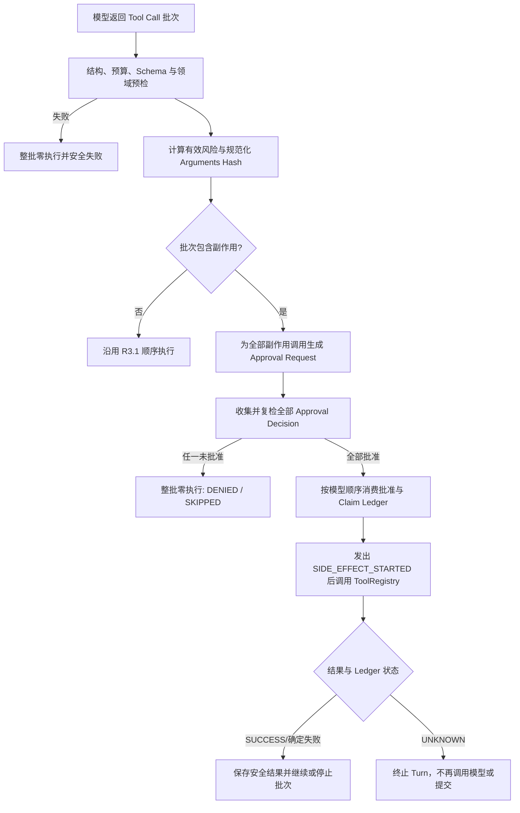

# Tool Approval Framework 设计

- 状态：草案
- 日期：2026-07-14
- 阶段：R3.2
- Contract：[Tool 审批、副作用、幂等与沙箱安全契约](../contracts/tool-approval-side-effect-safety.md)
- 前置实现：[Tool Runtime 安全加固](2026-07-14-tool-runtime-safety-design.md)

> 本设计只有在 Contract 明确批准后才能实施。设计范围止于默认拒绝的 Framework 与测试 Fake，不注册或执行真实副作用工具。

## 1. 目标

在现有有界 Tool Loop 中加入一个由 Application 拥有的副作用控制层，使 `WRITE` 和 `EXTERNAL_SIDE_EFFECT` 调用在 Invoker 之前完成整批预检、指纹绑定、审批决定和幂等 Claim。

完成后应能用确定性 Fake 证明：未批准零执行、批准只执行一次、拒绝/过期/取消不越过副作用边界、重复或未知状态不自动重试。

## 2. 非目标

- 不实现文件、Shell、Web、消息、记忆或外部系统工具。
- 不实现审批 UI、HTTP API、CLI 或渠道通知。
- 不持久化 Pending Turn，不支持审批后跨请求恢复。
- 不新增 SQLite 表，不在生产中使用内存 Ledger 执行副作用。
- 不改变 Provider Function Calling 协议，不让 Spring AI 执行工具。
- 不实现 Tool 并行、自动重试、补偿或后台执行。

## 3. 模块与依赖

### 3.1 `agent-kernel`

新增纯 JDK 协议类型候选：

- `ApprovalRequest`
- `ApprovalDecision`
- `ApprovalDecisionStatus`
- `ApprovalState`
- `SideEffectExecutionState`
- `SideEffectIdentity`
- `IdempotencyKey`

现有 `ToolRisk` 三值保持不变。`ToolResultStatus.DENIED/SKIPPED` 从预留状态变为活动状态。

生命周期候选新增 `APPROVAL_REQUESTED`、`APPROVAL_RESOLVED`、`SIDE_EFFECT_STARTED`、`SIDE_EFFECT_COMPLETED`。事件仍使用项目类型，不引入 Spring、Jackson、JDBC 或 Provider SDK。

### 3.2 `agent-application`

新增 Port 与策略候选：

- `ApprovalPort`：提交不可变请求并返回决定；生产默认实现只拒绝。
- `SideEffectLedger`：Claim、状态转换和已存安全结果读取。
- `ApprovalFingerprint`：规范化参数并计算版本化指纹。
- `ToolExecutionPolicy`：计算有效风险与执行边界。
- `ToolApprovalGate`：校验决定、过期、取消与一次性消费。
- `SideEffectBatchCoordinator`：整批预检、审批、Claim 和顺序执行。
- `IdGenerator`：测试可控地生成 Turn、Approval 和 Idempotency ID。

现有 `ToolLoop` 继续拥有模型循环与最终提交，`ToolRegistry` 继续拥有真实 Invoker、并发许可、Deadline 和安全结果。Coordinator 位于二者之间，不把审批职责塞进 Tool 实现或 Spring AI Callback。

### 3.3 `agent-bootstrap`

- `AgentProperties` 在 Contract 批准后接受 `APPROVAL_REQUIRED`。
- 默认装配 `DenyAllApprovalPort`。
- `DISABLED` 和 `READ_ONLY` 行为保持现状。
- 不注册 `WRITE/EXTERNAL_SIDE_EFFECT` 生产 Tool。
- 不暴露 Approval Controller，不新增数据库 Schema。

测试 Fake 放在对应模块测试源码或现有测试夹具中，不进入生产 Bean。

## 4. 调用流程

## 5. Tool Definition 可见性

`ToolLoop` 每次请求模型时，根据模式使用不可变 Definition Snapshot：

| 模式 | Definition Snapshot |
| --- | --- |
| `DISABLED` | 空 |
| `READ_ONLY` | 仅 `READ_ONLY` |
| `APPROVAL_REQUIRED` | 已批准注册范围内的三类 Tool |

Model Adapter 只看 Definition，不知道审批状态。即使模型伪造 Approval 字段，也只会作为普通 Tool Arguments 进入 Schema 校验并被拒绝或忽略，不能影响 Gate。

## 6. 指纹实现

`ApprovalFingerprint` 分两步：

1. `CanonicalArguments` 把已验证参数转换为版本化确定字节序列。
2. 对长度前缀绑定字段计算 SHA-256。

实现不得依赖 `Map.toString()`、默认 Locale、平台换行或 Jackson 的未固定序列化顺序。数值必须在解析阶段保留足够类型信息，避免 `1`、`1.0` 和科学计数法出现无意碰撞。

参数规范化失败属于预检失败，不能创建 Approval Request。

## 7. 批次协调器

### 7.1 预检阶段

Coordinator 接收完整调用批次和当前 Turn Context：

- 先调用现有 Runtime 批次校验，但不执行 Invoker。
- 为每个调用取得不可变 Tool Registration Snapshot。
- 计算有效风险；Policy 只允许升高风险。
- 生成 Turn ID、Operation ID 和 Approval Request。
- 在所有决定验证完成前，Invoker 次数保持零。

需要把现有 ToolRegistry 的“验证”与“执行”边界显式分开，避免为了审批而重复解析或让 Approval Port 接触真实 Tool 对象。

### 7.2 决定阶段

- `READ_ONLY` 调用视为无需审批，但仍等待批次中所有副作用决定。
- 任一 `DENIED/EXPIRED`：批次不执行，按模型顺序生成 `DENIED/SKIPPED`。
- 任一 `CANCELLED` 或 Turn Token 已取消：终止 Turn，不提交。
- Approval Port 抛错、返回空值、错 ID、错 Fingerprint 或迟到决定：Fail Closed。

### 7.3 执行阶段

- 在每个副作用调用前原子消费批准并 Claim Ledger。
- Claim 已为 `SUCCEEDED/FAILED` 时返回已存安全结果，不调用 Invoker。
- Claim 为 `RUNNING/UNKNOWN` 时抛出稳定未知状态错误。
- 只有新 Claim 可以发出 `SIDE_EFFECT_STARTED` 并进入 ToolRegistry。
- 第一个非成功副作用结果后，后续调用统一 `SKIPPED`。

## 8. Approval Port 形态

候选版本 1 使用同步 Port，只为了固定 Application 边界和支持确定性 Fake。生产实现为 `DenyAllApprovalPort`，不会阻塞 HTTP 请求。

不实现“等待五分钟直到用户点击”的阻塞 Port，因为当前 HTTP Timeout、Session Gate 和 Turn 内存 Transcript 都不支持安全挂起。真实人类审批需要后续设计 Durable Pending Turn 与认证入口，再决定同步、异步或恢复式 Port。

## 9. Ledger 形态

Port 操作候选：

- `reserve(identity, approval)`
- `markRunning(identity)`
- `markSucceeded(identity, safeResult)`
- `markFailed(identity, safeResult)`
- `markUnknown(identity, errorCode)`
- `find(identity)`

每次转换必须比较预期旧状态，防止并发消费。候选版本 1 只提供测试用 `InMemorySideEffectLedger`；生产装配不提供可执行 Ledger，因此 `APPROVAL_REQUIRED` 下没有真实副作用 Tool。

后续 Durable Adapter 必须另行批准 SQLite Schema、事务、崩溃恢复、清理期限和迁移回退。

## 10. 生命周期与观察

`ToolLoop`/Coordinator 发出审批事件，`ToolRegistry` 继续发出执行结果。为避免“开始处理”等同于“副作用已经发生”，明确：

- `TOOL_CALL_STARTED`：Runtime 开始处理调用。
- `APPROVAL_REQUESTED/RESOLVED`：审批协议。
- `SIDE_EFFECT_STARTED`：已经完成 Claim，即将进入真实边界。
- `SIDE_EFFECT_COMPLETED`：Side Effect 已有确定或未知结果。
- `TOOL_CALL_COMPLETED`：本次调用对 Tool Loop 的最终投影。

事件可增加不透明 `correlationHash`，但不得增加原始 Approval ID、Arguments Hash、Idempotency Key、Actor 或 Summary。Durable Audit 使用独立 Port，不把审计职责塞进普通 Logger。

## 11. 错误模型

新增稳定 Application 错误候选：

- `ApprovalUnavailableException` -> `APPROVAL_UNAVAILABLE`
- `ApprovalMismatchException` -> 对外仍映射 `APPROVAL_UNAVAILABLE`
- `SideEffectStateUnknownException` -> `SIDE_EFFECT_STATE_UNKNOWN`

不向 HTTP 暴露“ID 不存在”“Fingerprint 错误”“Actor 不匹配”等细节，避免成为审批记录枚举接口。公开 HTTP 映射在没有真实 Approval API 时沿用安全 `502`，具体字段必须在后续 HTTP Contract 中批准。

## 12. 测试设计

测试组件：

- `FakeApprovalPort`：按 Approval ID/Tool 返回确定决定并记录请求。
- `FakeSideEffectLedger`：支持状态注入和并发 Claim。
- `CountingSideEffectTool`：只增加内存计数，不访问文件或网络。
- `MutableClock`/固定 Clock。
- 确定性 `IdGenerator`。
- `RecordingLifecycleObserver`。

并发测试使用 Barrier、Latch 或可控 Starter，不使用任意 `sleep`。隐私测试使用哨兵 Arguments、Summary、Actor 和异常正文，断言它们不进入 Result、Lifecycle、HTTP 或日志。

## 13. Golden 设计

新增 `testdata/golden/tools/approval-side-effects.json`：

- Python Reference 只生成风险标签、Hook `denied` 和结果状态的共同投影。
- Migration Contract 生成 Java 更严格的审批、一次性消费、幂等和 Lifecycle 轨迹。
- `pythonEvidence` 明确哪些 Case 是 Python Reference，哪些是批准的安全差异。

生成器不能调用真实 Tool、Shell、网络或 Workspace。Fixture 中只使用固定 Hash 和测试 ID，不包含真实路径、命令、消息或密钥。

## 14. 配置与发布

候选新增配置：

| 配置 | 环境变量 | 候选默认值 | 说明 |
| --- | --- | --- | --- |
| `agent.tools.mode` 新值 | `AGENT_TOOL_MODE` | 保持 `READ_ONLY` | 新增显式 `APPROVAL_REQUIRED` |
| `agent.tools.approval-timeout` | `AGENT_TOOL_APPROVAL_TIMEOUT` | `5m` | Request 过期时间；不代表 HTTP 阻塞时间 |

`approval-timeout` 必须大于零且有上限；上限候选为 15 分钟。当前 `.env.example` 继续使用 `DISABLED`，不增加会误导为可用的 Approval Channel 配置。

## 15. 实施完成标准

- Contract 已批准，核心 Tool Contract 已同步升级。
- 新模式和协议类型有 RED/GREEN 证据。
- Fake Side Effect 的未批准、批准、重复、并发、未知和失败提交语义全部验证。
- 默认、`failure`、`compat` 和架构/Secret/Workspace 门禁全绿。
- 生产没有 Side Effect Tool、Approval API、Durable Pending Turn 或新 SQLite Schema。
- 部署和模板继续为 `DISABLED`。

## 16. 后续里程碑

R3.2 Framework 完成后仍不能直接实现 Shell/Web。建议后续顺序：

1. Approval Channel 与 Durable Pending Turn Contract。
2. Durable Approval/Audit/Idempotency SQLite Schema Contract。
3. 隔离 Workspace 文件写入 Tool Capability Contract 与只读副本演练。
4. 文件工具稳定后，再分别评估消息发送和受限 Web 写入。
5. Shell 保持最后，且不默认提供任意 Shell 字符串能力。
