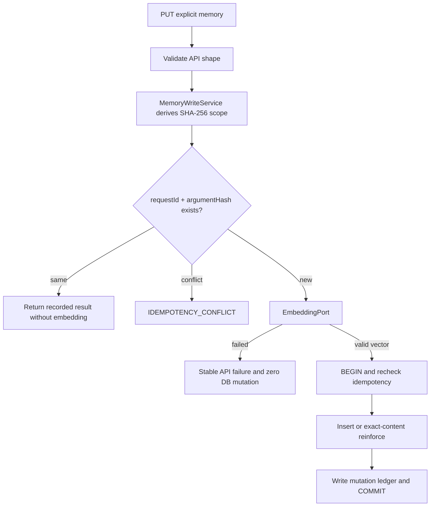
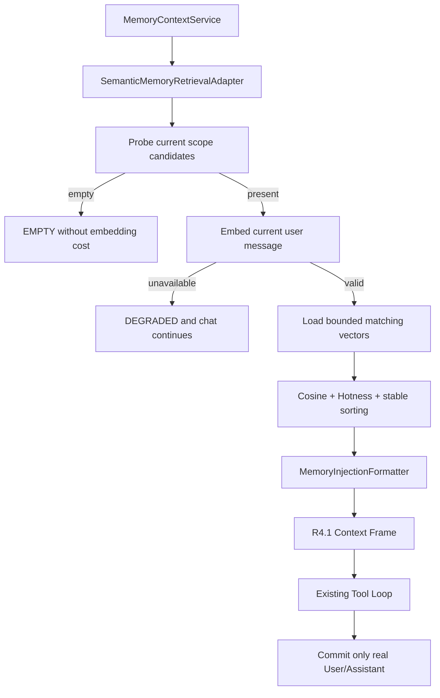

# Java 原生语义记忆纵向切片设计

- 状态：已实现并验证（Task J1–J12 已完成）
- 日期：2026-07-15
- 批准记录：2026-07-15，用户批准新版方案并授权从 Task J1 开始实施
- 阶段：R4.2
- Contract：[Java 原生语义记忆、持久化与优化器契约](../contracts/semantic-memory-persistence-optimizer.md)
- ADR：[ADR-0005：采用 Java 原生语义记忆库](../adr/0005-use-java-native-semantic-memory-store.md)

## 1. 目标

在不使用 Python 运行时、Python Schema 或旧 Python 记忆的前提下，实现一个默认关闭、显式写入、可删除、可检索的 Java 原生记忆纵向切片：

```text
Memory API -> MemoryWriteService -> EmbeddingPort -> agent-memory.db
ChatService -> MemoryRetrievalPort -> EmbeddingPort -> Semantic Search
             -> MemoryInjectionFormatter -> R4.1 Context Frame
```

本阶段以“可用的最小闭环”为完成单位：新库必须能写入、查看、删除和召回。只实现 Reader 会让空库永久无效，因此不再采用原草案的未接线 Writer 方案。

## 2. 非目标

- 不读取、迁移或删除 Python `memory2.db`。
- 不运行 Python Golden 生成器或 Python 测试作为 R4.2 门禁。
- 不自动分析所有聊天并写入记忆。
- 不开放模型可调用的 Memory Tool。
- 不实现 Keyword/RRF、Rewrite/HyDE、ANN 或远程 Vector Store。
- 不实现 Optimizer、Scheduler、Consolidation、Backfill 或跨 Session 身份。
- 不访问真实 Workspace、真实 Embedding Provider 或真实用户记忆。

## 3. 模块设计

### 3.1 `agent-kernel`

新增纯 JDK 类型和 Port：

- `EmbeddingPort`、`EmbeddingRequest`、`EmbeddingResult`。
- `MemoryStorePort`：候选探测、检索、列表。
- `MemoryWritePort`：写前幂等重放查询、事务内幂等 Upsert 和物理删除。重放查询按 Scope、Request ID 与 Argument Hash 原子读取 Ledger 和当前 Item 快照，避免网络重试再次调用 Embedding。
- `MemoryItem`、`MemoryType`、`MemoryWriteCommand`、`MemoryWriteResult`。
- `MemorySearchRequest`、`MemorySearchHit`、`MemoryScope`。
- `MemoryRetrievalStatus.DEGRADED`。
- `MemoryRuntimeMode.JAVA_NATIVE`。

所有集合和向量进行 Defensive Copy。Kernel 不包含 `Path`、SQL、JSON、Spring、Spring AI、HTTP 或供应商类型。

### 3.2 `adapter-sqlite`

新增：

- `JavaMemorySchemaInitializer`：创建 V1、验证版本、迁移前一致性备份。
- `JdbcJavaMemoryStore`：实现读、写、列表和物理删除。
- `Float32VectorCodec`：Little-Endian Float32 BLOB 编解码与严格验证。
- `JavaMemoryRepositoryException`：只暴露稳定分类。

单个 Store 可以实现 Reader/Writer Port，但 Application 与 Bootstrap 仍通过窄 Port 注入，避免 Retrieval 获得写能力。

资源规则：

- 每次操作短生命周期 Connection/Statement/ResultSet。
- `busy_timeout` 有界。
- 写入、强化、删除和 Mutation Ledger 使用显式事务。
- Schema Migration 与正常写入不能并发。
- Initializer 只接受固定文件名 `agent-memory.db`；不存在或空库直接创建 V1，合法 V0 Marker 先经 SQLite Backup API 备份再迁移。
- V1 启动只验证不改写 Schema Timestamp 或数据；同名不兼容对象、额外表、View、Trigger、损坏库和任意未来版本 Fail Closed。
- SQL 不拼接用户字段；所有值使用参数。

### 3.3 `adapter-spring-ai`

新增 `SpringAiEmbeddingAdapter`：

- 依赖 Kernel `EmbeddingPort` 与 Spring AI `EmbeddingModel`。
- 在 Adapter 边界完成 Strip、Code Point 截断、最多 10 条批次、输出顺序、维度、有限值和零范数验证。
- 返回 Kernel 自有不可变向量。
- 测试使用 Fake `EmbeddingModel`，不发 HTTP。

### 3.4 `agent-application`

新增：

- `MemoryWriteService`：校验命令、生成 Session Binding、调用 Embedding、调用 Writer。
- `MemoryQueryService`：按 Scope 列出可公开字段。
- `MemoryDeleteService`：校验 Scope、Request ID 和物理删除。
- `SemanticMemoryRetrievalAdapter`：实现既有 `MemoryRetrievalPort`。
- `MemoryInjectionFormatter`：类型数量、完整行和字符预算。

职责分离：

- Write Service 不构造 Prompt。
- Retrieval 不获得 Writer Port。
- SQLite 不调用 Embedding。
- Spring AI 不访问数据库。
- HTTP 不计算 Hash、Scope Binding 或 Vector。

### 3.5 `agent-bootstrap`

新增 Memory Controller 和配置装配：

- `JAVA_NATIVE` 创建/验证 `agent-memory.db` 并装配 Memory API、Embedding 和 Retrieval。
- `JAVA_NATIVE` 从空 Java Memory Profile 开始，不读取 R4.1 Markdown 或旧 Python 语义记忆。
- `READ_ONLY` 保持 R4.1 行为，不创建 Java Memory DB。
- `DISABLED` 零文件、零 Embedding、零 Memory API。
- 非 Loopback 监听时拒绝启用 `JAVA_NATIVE`，直到项目具备认证授权。
- Spring Context 不包含 Optimizer、Scheduler、Memory Tool、Python Bridge 或 Vector Store Bean。

## 4. 配置

扩展 `agent.memory`：

| 配置 | 环境变量 | 默认值 |
| --- | --- | --- |
| `mode` | `AGENT_MEMORY_MODE` | `DISABLED` |
| `embedding.model` | `AGENT_MEMORY_EMBEDDING_MODEL` | `text-embedding-v3` |
| `embedding.dimensions` | `AGENT_MEMORY_EMBEDDING_DIMENSIONS` | `1024` |
| `embedding.max-text-code-points` | `AGENT_MEMORY_EMBEDDING_MAX_TEXT_CODE_POINTS` | `2000` |
| `retrieval.top-k` | `AGENT_MEMORY_RETRIEVAL_TOP_K` | `8` |
| `retrieval.score-threshold` | `AGENT_MEMORY_RETRIEVAL_SCORE_THRESHOLD` | `0.45` |
| `retrieval.hotness-alpha` | `AGENT_MEMORY_RETRIEVAL_HOTNESS_ALPHA` | `0.20` |
| `retrieval.hotness-half-life-days` | `AGENT_MEMORY_RETRIEVAL_HOTNESS_HALF_LIFE_DAYS` | `14` |
| `retrieval.max-candidates` | `AGENT_MEMORY_RETRIEVAL_MAX_CANDIDATES` | `10000` |
| `retrieval.max-injected-characters` | `AGENT_MEMORY_RETRIEVAL_MAX_INJECTED_CHARACTERS` | `6000` |

Provider Base URL、API Key、Timeout 和 Retry 继续由 Spring AI Adapter 配置负责。配置检查只验证存在性和范围，不连接 Provider、不创建 Workspace。

## 5. 写入数据流



Hash 规范化由 Application 的纯 JDK helper 固定：使用 `String.strip()` 语义、把连续 `Character.isWhitespace` 压成一个 ASCII 空格、保留 Unicode 原文，再对 UTF-8 字节做 SHA-256。大小写和 Unicode Form 均不折叠，避免 Java 原生记忆把有意义的差异合并。

Mutation Argument Hash 使用 Contract 固定的 V1 Length-Prefixed Binary Encoding：每个字段写 4 Byte Big-Endian UTF-8 Byte Length 和内容。写入覆盖 Operation、类型、Content Hash、Emotional Weight 与 HappenedAt；删除覆盖 Operation 与 Item ID。Scope 和 Request ID 分别由 Ledger 组合键承载，不进入 Argument Hash。

Item ID 和 Request ID 分离：Item ID 由服务端安全生成，Request ID 由调用方提供并用于网络重试幂等。

## 6. 检索数据流



同一 Turn 只执行一次候选探测、一次 Query Embedding 和一次检索。Tool Loop 后续模型调用复用不可变 Frame。

## 7. Scope 设计

当前系统没有认证用户或 Channel Identity，因此 R4.2 使用 Session Binding：

- Chat 与 Memory API 对相同 Session ID 生成相同 SHA-256 Scope。
- 数据库不保存原始 Session ID。
- 查询、列表和删除都必须精确匹配 Scope。
- 不提供 Global Scope 或 Fallback。
- 需要长期跨会话记忆的客户端必须复用稳定 Session ID。

这是安全优先的阶段限制，不代表最终用户模型。R6 引入身份后需要新的 Scope Migration Contract。

## 8. 向量与排序

### 8.1 Float32 BLOB

- 写入使用 Little-Endian IEEE-754 Float32。
- `BLOB.length == dimensions * 4`。
- 编解码拒绝 NaN、Infinity、维度不匹配和零范数。
- 查询向量与条目必须使用相同逻辑模型名和维度。

### 8.2 排序

使用 `double` 累加 dot product 和 norm：

```text
semantic = cosine(query, item)
hotness = frequency(reinforcement) * decay(updatedAt, emotionalWeight)
final = (1 - alpha) * semantic + alpha * hotness
```

基础 semantic threshold 在 Hotness 混合前执行。排序使用未格式化分数，并以 semantic、updatedAt、ID 做确定性 Tie-Break。Trace 不包含分数或正文。

## 9. API 设计

Memory Controller 只做协议转换：

- `PUT /api/v1/sessions/{sessionId}/memories`：显式创建或强化。
- `GET /api/v1/sessions/{sessionId}/memories`：按 UpdatedAt DESC、ID ASC 列表，固定最大 100 条。
- `DELETE /api/v1/sessions/{sessionId}/memories/{memoryId}`：按 Request ID 幂等物理删除；Request ID 使用 `Idempotency-Key` Header。

PUT 的 Request ID 放在正文；DELETE 使用 Header，避免 DELETE Body。Response 不返回向量、Hash、Scope 或内部 Provider 配置。

- PUT `CREATED` 返回 HTTP 201；`REINFORCED` 返回 HTTP 200，Body 为 `status + memory`。
- GET 返回 HTTP 200 和最多 100 条公开 Memory，排序为 `updatedAt DESC, id ASC`。
- DELETE `DELETED` 返回 HTTP 200 和 `status + id`；`NOT_FOUND` 返回 HTTP 404 Problem Detail。

所有错误映射到稳定 Code，不返回 SQL、路径、正文、Session Binding 或 Provider Message。

Controller 始终通过 `MemoryManagementApi` 门面访问 Application 用例。`DISABLED`/`READ_ONLY` 在 J10 装配前后都使用不可用门面并稳定返回 503；只有通过 Loopback 启动门禁的 `JAVA_NATIVE` 才可替换为 Write/List/Delete 门面。请求 DTO 拒绝未知字段，因此客户端不能借额外 JSON 字段提交 Embedding、Hash、Scope 或内部时间戳。

## 10. 并发与失败

- 同一 Request ID 由数据库唯一键保证幂等，不依赖 JVM 锁。
- 相同内容的并发 Upsert 由唯一键和事务收敛为一条；失败方重读后强化或返回原结果。
- UPSERT 重放返回 Ledger 的原 Status/Item ID 与条目当前快照；条目已被物理删除时 Fail Closed，禁止复活已删除内容。
- 列表与检索只读，不改变 Hotness 字段。
- Schema 迁移有进程内独占 Gate；未来多进程部署前另立租约 Contract。
- 首次幂等探测在 Embedding 前完成，网络重试零额外费用；事务内再次检查以处理并发竞态。
- Embedding 在写事务外完成，避免持锁等待网络。
- 应用关闭时没有 Memory 后台任务需要 Drain。

## 11. 安全差异

- Java 不迁移 Python 中“记忆可以要求必须调用工具”的行为。
- `PROCEDURE` 只是文本类型，不具备执行权。
- 普通聊天不会隐式写记忆；只有显式 Memory API 改变数据。
- Forget 物理删除正文和 Embedding，不保留可被恢复的内容副本；迁移备份按运维保留策略单独管理。
- 未认证远程监听下禁止启用 Memory API。

## 12. 验收策略

- Java-owned Contract Fixture 固定 Schema、Vector Codec、HTTP 和 Injection，不依赖 Python。
- SQLite、HTTP 和端到端测试只使用临时 Workspace。
- Spring AI 测试只使用 Fake Model。
- Failure Profile 覆盖 Schema、备份、事务、幂等冲突、非法向量、候选超限和 Provider 故障。
- Compat Profile 在 R4.2 表示 Java Contract 的向后兼容，不再表示 Python Memory 数据兼容。
- 阶段门禁禁止真实 Workspace、真实 Embedding 和物理删除旧 Python 数据。

J11 已由 `JavaNativeMemoryContractTest` 直接消费 J1 的 10 个 Java-owned Case，并通过生产 Schema/Codec/Store/Application/HTTP/Search/Formatter 做纵向核对；`JavaNativeMemoryFailureTest` 则固定零写入、幂等冲突和持久化安全失败。聚焦 `compat` 与 `failure` 各执行 4 个测试且全部通过，没有运行 Python、真实 Provider 或真实 Workspace。

J12 最终门禁记录（2026-07-15）：默认 244 个测试（235 单元、9 集成），`failure` 55 个（54 单元、1 集成），`compat` 282 个（272 单元、10 集成）全部通过；Kernel 生产零外部依赖，Secret/Workspace/产物、默认关闭、Loopback、生产 Bean 和禁止 Python/旧库访问的静态审计通过。
