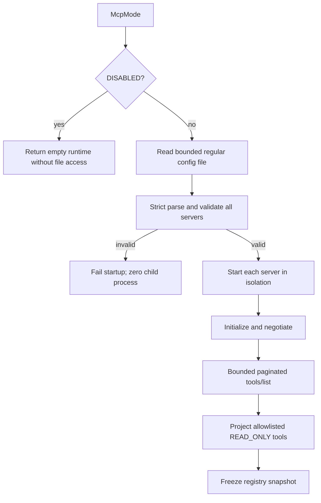
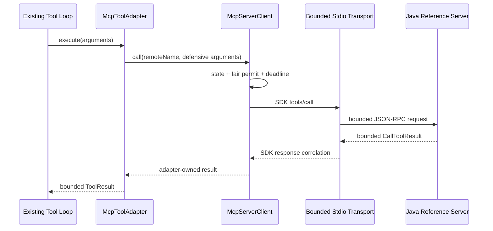

# MCP 只读客户端纵向切片设计

- 状态：已实现并验证
- 日期：2026-07-15
- 批准记录：2026-07-15，用户要求先合并并推送既有 Java 主线，随后开始实现 MCP 只读客户端纵向切片
- 阶段：R5.1
- Contract：[MCP 只读客户端与 Tool Runtime 契约](../contracts/mcp-client-tool-runtime.md)
- ADR：[ADR-0006：采用官方 MCP Java SDK 并自持有界 stdio Transport](../adr/0006-use-official-mcp-java-sdk.md)

## 1. 目标

实现一个默认关闭、静态配置、只读、stdio-only 的 MCP Client，使受控 MCP Tool 能作为现有 Kernel `Tool` 进入同一 Tool Registry、预算、风险门禁、Tool Loop 和会话提交语义。

```text
Strict static config
  -> adapter-mcp runtime
  -> bounded stdio + official SDK client
  -> initialize + paginated tools/list
  -> deterministic projection
  -> existing ToolRegistry snapshot
  -> tools/call + cancellation
  -> bounded text ToolResult
  -> existing Chat Tool Loop
```

完成标准不是“能连一个 Server”，而是以 Java Reference Server 证明发现、投影、调用、取消、故障隔离、Stale、重连和进程回收都满足 Contract。

## 2. M0 SDK Spike 结论

已验证官方 MCP Java SDK `2.0.0`：

- Maven 坐标 `io.modelcontextprotocol.sdk:mcp:2.0.0` 可解析，许可证为 MIT。
- SDK Client 支持 MCP `2025-11-25`、初始化、Tools、分页和 Tools List Changed Consumer。
- `mcp-json-jackson3` 使用 Jackson 3 API；当前 Spring Boot 4 Dependency Management 下的有效 Reactor 依赖树解析为 Jackson Databind `3.1.4`，兼容测试已通过。
- `mcp-core` 引入 Reactor；通过独立 Adapter 可以阻止 Reactor 进入 Kernel/Application。
- 内置 `StdioClientTransport` 使用无界 `BufferedReader.readLine()`，不能在 JSON 反序列化前执行 Wire 字节上限。
- `ServerParameters` 会默认继承 HOME、PATH、SHELL 等变量，且内置 Transport 在现有 Environment 上追加值，不满足“先清空再 Allowlist”。
- `McpClientSession.sendRequest` 在取消订阅时不发送 `notifications/cancelled`，也不从 Pending Map 主动删除请求。

因此不直接使用 SDK 内置 Stdio Transport。实现使用官方 Async Client、Schema、Request ID 和 Jackson 3 Mapper，并提供 Adapter 私有的 `BoundedStdioClientTransport`。Transport 拦截准确的 `tools/call` Request ID，由 Adapter 调用句柄在外层中断时发送 Cancellation。

这项决定必须由 M5 Wire 测试最终证明；在该测试变绿前，生产装配保持 `DISABLED`。

## 3. 模块与依赖

新增 `adapter-mcp`：

```text
agent-bootstrap ---> adapter-mcp ---> agent-kernel
                         |
                         +----> official MCP Java SDK 2.0.0

agent-application ---> agent-kernel
```

- Adapter 公共 API 只暴露项目自有的配置、Runtime、Status 和 `List<Tool>`。
- SDK、Reactor、JSON-RPC、Jackson、Process 和 Transport 实现保持 Adapter 内部可见。
- Application 不依赖 Adapter；Bootstrap 先构造 MCP Runtime，再把 Adapter 生成的 Kernel Tool 与本地 Tool 合并为一次性 Registry 输入。
- Adapter 不依赖 Conversation、Approval、Ledger、Memory Writer 或 Spring AI。

## 4. 组件

| 组件 | 可见性 | 职责 |
| --- | --- | --- |
| `McpMode` | 公共 | `DISABLED` / `STATIC_READ_ONLY` |
| `McpSettings` | 公共 | 已验证的全局上限与静态配置路径 |
| `McpConfigLoader` | 公共入口、内部 DTO | 有界读取、严格 JSON、路径与全集预验证 |
| `McpServerDefinition` | 公共不可变值 | 安全 Server 配置，只持有环境变量名 |
| `McpRuntime` | 公共 | 启动所有 Server、汇总 Tool、状态与幂等关闭 |
| `McpServerClient` | 包私有 | 单 Server 生命周期、Catalog、调用、Stale 与一次重连 |
| `BoundedStdioClientTransport` | 包私有 | Process、Wire、环境、Reader/Writer/Drain、Cancellation 与关闭 |
| `McpToolNameMapper` | 公共纯函数 | 稳定本地名称 |
| `McpToolProjector` | 包私有 | Allowlist、风险、说明与 Schema 安全投影 |
| `McpToolAdapter` | 包私有 | Kernel `Tool` Wrapper、调用与稳定 Result 映射 |
| `McpRuntimeStatus` | 公共只读 | 无敏感数据的 Server 状态和计数 |

## 5. 启动顺序



全集配置验证与单 Server 运行失败分开：前者阻止启动，后者只产生 `UNAVAILABLE` 状态和零 Tool，不影响其他 Server 或普通聊天。

## 6. Transport 设计

### 6.1 Process

- `ProcessBuilder(List<String>)` 直接启动绝对 Executable。
- Working Directory 在解析 Real Path 后设置。
- Environment 先 `clear()`，再按变量名 Allowlist 查询父进程并复制存在值。
- 生产代码不把完整命令、参数、路径或环境放入 `toString()`、异常或日志。

### 6.2 Wire

不能使用 `BufferedReader.readLine()`。Inbound Reader 逐字节读取：

- 在累计字节数超过 `maxWireBytes` 时立即失败，不继续分配整行。
- 只接受 UTF-8；Malformed/Unmappable 输入失败。
- 单个 JSON-RPC 消息以 LF 结束，允许终止 LF 前的单个 CR，但 JSON 正文不得包含原始换行。
- EOF 前存在非空未终止消息视为协议错误。
- 完成字节边界后才解码和调用 SDK Mapper。

Outbound 先序列化为 UTF-8；超过上限不写入任何字节。每条消息在同一 Writer 临界区原子写入正文与 LF。

### 6.3 SDK Request ID 与 Cancellation

Transport 在 `sendMessage` 观察 SDK 创建的 `JSONRPCRequest`。当 Method 为 `tools/call` 时，将 Request ID 交给当前唯一的调用句柄；调用句柄由每 Server 公平许可保证不会错绑并发请求。

外层中断路径：

1. 原子把调用状态从 `ACTIVE` 变为 `CANCELLING`。
2. 若 Request 已写入，则直接通过 Transport 发送 `notifications/cancelled`，参数为 `requestId` 和固定 Reason。
3. Dispose SDK Subscription / Future，停止本地等待。
4. 标记 Request ID 为本地已取消，丢弃迟到的业务结果。
5. 释放调用许可；SDK Pending 状态由迟到 Response、Request Timeout 或 Client Close 清理。

M5 必须覆盖“取消发生在写入前、写入后响应前、响应竞态和迟到响应”四种情况。

### 6.4 关闭

Runtime 先把状态变为 `CLOSING`，防止新调用和重连。每个 Server：

1. 取消在途 Request。
2. 关闭 stdin，给 Server 正常 EOF。
3. 等待剩余 Shutdown Deadline。
4. `destroy()` 发送 TERM。
5. 再等待剩余 Deadline。
6. `destroyForcibly()`。
7. Join Reader、Writer、stderr Drain，并关闭 SDK Client。

所有步骤幂等；即使 SDK Close、流 Close 或 Process Wait 失败，也继续尽最大努力回收剩余资源。

## 7. 配置模型

配置只存运维声明，不存运行状态或 Secret：

```json
{
  "schemaVersion": 1,
  "servers": [
    {
      "id": "docs",
      "transport": "STDIO",
      "executable": "/absolute/path/to/java",
      "arguments": ["-cp", "/absolute/path/to/test-classes", "ReferenceServer"],
      "workingDirectory": "/absolute/path/to/runtime",
      "environmentVariables": ["DOCS_MCP_TOKEN"],
      "tools": {
        "search": {"enabled": true, "risk": "READ_ONLY"}
      }
    }
  ]
}
```

Jackson Reader 开启未知字段失败、重复键失败、Trailing Token 失败和 Stream Constraint。配置文件字节上限独立于 Wire 上限。所有配置对象在构造时 Defensive Copy。

## 8. Catalog 与投影

SDK 的便捷 `listTools()` 会自动消费全部分页，无法实施本契约的页数上限。因此 Adapter 逐页调用 `listTools(cursor)`，对每页在合并前检查：

- 页数和 Tool 总数。
- Cursor 非空、未重复并有最大长度。
- Tool Name 唯一。
- 说明和 Schema UTF-8 字节数。
- Schema 深度、属性数、允许关键字与类型。

Catalog 规范化指纹输入按 Remote Name 排序，包含 Remote Name、Description 和规范化 Input Schema；使用 Length-Prefixed UTF-8 编码后计算 SHA-256。Annotation、发现顺序和 Cursor 不进入指纹。

Allowlist 是本地配置与 Catalog 的交集。投影产生 Kernel `ToolDefinition(localName, safeDescription, normalizedSchema, READ_ONLY)` 和持有 Remote Name 的 Wrapper。Server 的 Tool Annotation 不进入 Kernel。

## 9. 调用数据流



只转换 Text Content。Result 转换先验证整体类型和 `isError`，再连接 Text Block，最后交给现有 Tool Runtime 的字符上限。所有异常在 Adapter 边界归一化为少量内部分类；公开错误不包含 Server 内容。

## 10. 状态机

单 Server 状态：

```text
NEW -> CONNECTING -> READY
          |            |
          v            +-> STALE
      UNAVAILABLE      +-> DISCONNECTED
          ^                  |
          +--- one reconnect-+

any -> CLOSING -> CLOSED
```

- `STALE` 不允许调用；R5.1 不在运行时替换 Registry。
- `DISCONNECTED` 的下一次新调用可以成为唯一 Reconnect Owner。
- Reconnect 成功且 Catalog 指纹相同才回到 `READY`。
- Catalog 改变进入 `STALE`。
- `CLOSING/CLOSED` 永远不能重连或启动进程。

## 11. Bootstrap 集成

Bootstrap 配置阶段：

1. 绑定并验证 MCP 全局 Properties。
2. `DISABLED` 返回 `McpRuntime.disabled()`。
3. `STATIC_READ_ONLY` 加载 Config，启动 Runtime，得到不可变 `List<Tool>`。
4. 与本地生产 Tool 合并后交给现有 `ChatService` 构造。
5. 注册 Runtime Destroy Hook。

不使用 Spring AI MCP Starter，不自动把 MCP Tool 注入 Provider，不创建动态管理 API。MCP Runtime 的启动发生在 Tool Registry 快照之前，关闭发生在 Chat 接口停止接受新请求之后。

## 12. 测试设计

- Contract Fixture：Java 自有 JSON，固定配置、命名、Schema、结果、错误、取消、Stale 和关闭。
- 单元：配置、名称、Schema、指纹、状态机、Result 转换。
- Integration：同一 Maven Test JVM 启动仓库内 Java Reference Server 子进程；不使用 Python、Shell 或网络。
- Chat：Fake Model 第一次返回 MCP Tool Call，第二次断言 Assistant Tool Call 与 Tool Result 后返回最终文本。
- Failure：错误 JSON、错误 ID、超限行、stderr Flood、突然退出、忽略 EOF/TERM、列表变化和重连竞态。
- Architecture：Kernel/Application 不包含 `io.modelcontextprotocol`、`reactor`、Spring MCP 或 Adapter 类型。

Reference Server 通过命令行 Scenario 参数选择确定行为，不读取真实 Workspace 或环境，不包含生产能力。

## 13. 发布与回退

R5.1 完成后模板和生产仍保持 `DISABLED`。默认测试只证明受控 Java Reference Server，不授权真实 Server。真实 Smoke 需要另行批准 Executable、版本、Tool Allowlist、风险、Secret、网络、费用、沙箱和数据范围。

回退为关闭 MCP Mode 并重启；不需要数据库迁移。任何 Wire、Cancellation、Secret、Stale 或进程回收门禁失败都阻止启用。
