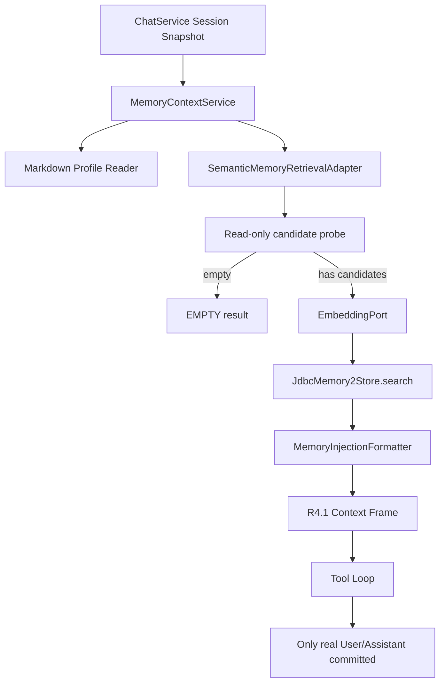
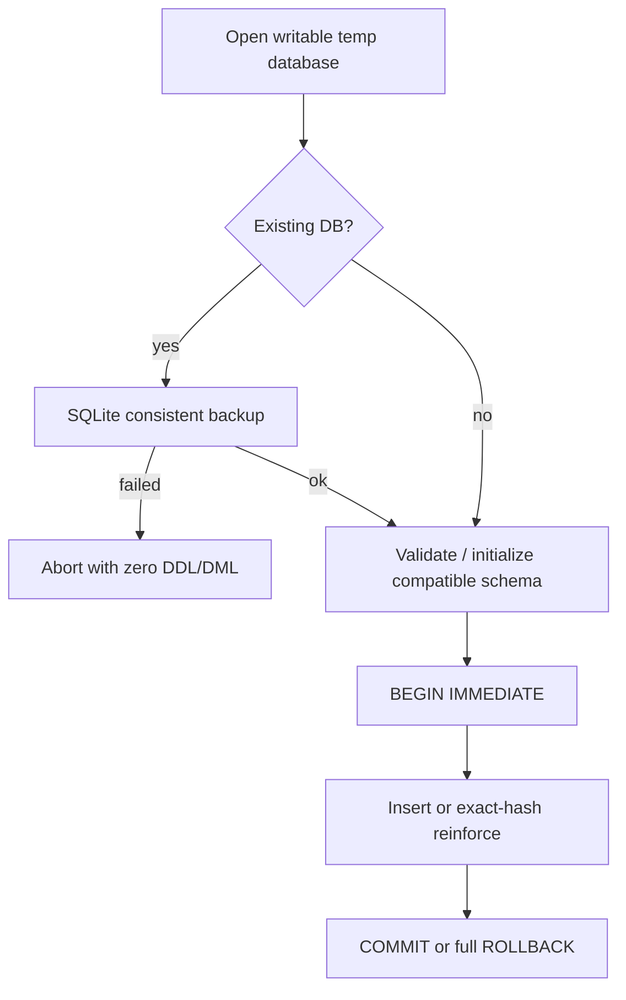

# Memory2 语义检索纵向切片设计

- 状态：待批准
- 日期：2026-07-15
- 阶段：R4.2
- Contract：[语义记忆、持久化与优化器契约](../contracts/semantic-memory-persistence-optimizer.md)
- ADR：[ADR-0005：`memory2` 先使用 Python 兼容 JSON 向量与有界全表检索](../adr/0005-use-python-compatible-json-vectors-for-memory2.md)
- Python 参考 Commit：`b65a5430e332c8733b981dfc2dfbc3eb1967e9ef`

## 1. 目标与范围

实现一个默认关闭、生产严格只读、可由 Python Golden 验证的 `memory2` 语义检索纵向切片：

```text
当前 User
  -> EmbeddingPort
  -> Python-compatible memory2.db Reader
  -> cosine / Hotness / Scope / Top-K
  -> Memory Injection Formatter
  -> R4.1 Context Frame
  -> 现有 Tool Loop 与原子 Conversation Commit
```

同时实现不接入生产的 SQLite Writer 原语，用测试冻结 Schema、精确去重、强化、事务和首次写入备份语义。Optimizer 只在 Contract 中冻结，不实现任何类、Bean 或 Scheduler。

## 2. Python 基准结论

Python 的当前共同子集为：

- `memory_items` 主表保存 JSON Embedding，`sqlite-vec` 不可用时正式回退全表 cosine。
- Active、类型、Scope 和基础 semantic threshold 在候选或评分阶段过滤。
- Hotness 使用 reinforcement、updated_at、14 天半衰期与 emotional_weight；默认 Engine 使用 `alpha=0.20`。
- 默认 Context Retrieval 对当前用户消息做向量检索，并按类型阈值与字符预算构造注入块。
- Embedding 单批不超过 10，单文本截到 2000 字符。
- 精确重复内容不会创建第二条，而是强化原条目。
- Optimizer 对 PENDING 做 Snapshot，先合并 MEMORY，再独立更新 SELF；Busy 时立即失败。

Java 不迁移的 Python 行为包括 Keyword/RRF、Query Rewrite、HyDE、时间查询、检索后强化、强制 Tool 记忆、Consolidation、Post Response Worker、Memory Tool 和 Dashboard 管理。

## 3. 模块与依赖设计

### 3.1 `agent-kernel`

新增纯 JDK 协议：

- `EmbeddingPort`：有序批量文本到不可变向量结果。
- `MemoryStorePort`：读取有界、已按数据边界过滤的候选条目。
- `MemoryWriterPort`：内部 Upsert 原语；不代表生产写入已启用。
- `MemoryItem`、`MemoryType`、`MemoryStatus`：Python 兼容核心字段。
- `MemorySearchRequest`、`MemorySearchResult`：候选上限、类型与安全 Scope。
- `MemoryWriteCommand`、`MemoryWriteResult`：精确去重和强化结果。
- `MemoryRetrievalStatus.DEGRADED`：Embedding 可用性故障的安全降级。
- `MemoryRuntimeMode.SEMANTIC_READ_ONLY`：显式启用 Profile + 只读数据库检索。

Kernel 不包含 `Path`、SQL、Jackson、Spring、Spring AI、Provider Options 或 Vector Store 类型。

### 3.2 `adapter-sqlite`

新增：

- `JdbcMemory2Store`：实现 `MemoryStorePort`，用 SQLite Read-Only URI 打开现有数据库，每次查询显式关闭 Connection、Statement 和 ResultSet。
- `JdbcMemory2Writer`：实现内部 `MemoryWriterPort`；构造时先备份已有数据库，再初始化/验证兼容 Schema。
- `Memory2Schema`：集中维护建表 SQL、必需列、索引和兼容诊断。
- `Memory2RepositoryException`：不携带路径、SQL、正文、JSON 或向量。

Reader 与 Writer 分离，防止“为了检索”获得 DDL/DML 能力。Reader 不依赖 Writer，也不调用 Schema Initializer。

候选 SQL 只读取：

```text
id, memory_type, summary, embedding, reinforcement,
emotional_weight, extra_json, source_ref, happened_at,
status, created_at, updated_at
```

JSON 由现有 Jackson 3 依赖解析。未知 `extra_json` 字段保存在 Kernel 的不可变 Map 中；检索只读取批准的 Scope 字段。

### 3.3 `adapter-spring-ai`

新增 `SpringAiEmbeddingAdapter`：

- 依赖 Kernel `EmbeddingPort` 和 Spring AI `EmbeddingModel`。
- 在 Adapter 边界做 Strip、Code Point 截断、单批上限、输出数量、维度、有限值和零范数验证。
- 使用 Spring AI 已配置的 Provider Options，不自行读取 API Key，不把 Provider Options 投影进 Kernel。
- 单元测试使用 Fake `EmbeddingModel`，不发 HTTP。

### 3.4 `agent-application`

新增 `SemanticMemoryRetrievalAdapter`，实现既有 `MemoryRetrievalPort`：

1. 调 `MemoryStorePort.hasCandidates(scope)`；空库直接 `EMPTY`。
2. 通过 `EmbeddingPort` 嵌入当前消息。
3. 调 `MemoryStorePort.search` 获得已排序 Hit。
4. 通过 `MemoryInjectionFormatter` 应用类型阈值、数量与字符预算。
5. 返回 R4.1 `MemoryRetrievalResult`，由既有 `MemoryContextService` 负责外层上限和异常收敛。

Application 负责用例策略，SQLite 不构造 Prompt，Spring AI 不查询数据库，Formatter 不控制 Agent Loop。

`SemanticMemoryRetrievalAdapter` 捕获明确的 `EmbeddingUnavailableException` 并返回 `DEGRADED`；SQLite 数据边界错误继续抛出，由 `MemoryContextService` 转成稳定失败。

### 3.5 `agent-bootstrap`

扩展 `agent.memory` 配置：

| 配置 | 环境变量 | 默认值 |
| --- | --- | --- |
| `mode` | `AGENT_MEMORY_MODE` | `DISABLED` |
| `embedding.dimensions` | `AGENT_MEMORY_EMBEDDING_DIMENSIONS` | `1024` |
| `embedding.max-text-code-points` | `AGENT_MEMORY_EMBEDDING_MAX_TEXT_CODE_POINTS` | `2000` |
| `retrieval.top-k` | `AGENT_MEMORY_RETRIEVAL_TOP_K` | `8` |
| `retrieval.score-threshold` | `AGENT_MEMORY_RETRIEVAL_SCORE_THRESHOLD` | `0.45` |
| `retrieval.hotness-alpha` | `AGENT_MEMORY_RETRIEVAL_HOTNESS_ALPHA` | `0.20` |
| `retrieval.hotness-half-life-days` | `AGENT_MEMORY_RETRIEVAL_HOTNESS_HALF_LIFE_DAYS` | `14` |
| `retrieval.max-candidates` | `AGENT_MEMORY_RETRIEVAL_MAX_CANDIDATES` | `10000` |
| `retrieval.max-injected-characters` | `AGENT_MEMORY_RETRIEVAL_MAX_INJECTED_CHARACTERS` | `6000` |
| `retrieval.allow-global` | `AGENT_MEMORY_RETRIEVAL_ALLOW_GLOBAL` | `true` |

四种类型阈值也在 `agent.memory.retrieval.thresholds.*` 下显式配置，默认值来自 Contract。

装配规则：

- `DISABLED`：Profile Empty、Retrieval NoOp、零文件和零模型访问。
- `READ_ONLY`：保持 R4.1 Markdown Profile Reader + Retrieval NoOp。
- `SEMANTIC_READ_ONLY`：Markdown Profile Reader + Read-Only `JdbcMemory2Store` + `SpringAiEmbeddingAdapter` + `SemanticMemoryRetrievalAdapter`。
- 所有模板继续默认 `DISABLED`；没有 `MemoryWriterPort`、Optimizer 或 Scheduler Bean。

## 4. 数据流与资源生命周期



- 每次 SQLite 操作都使用短生命周期连接；没有后台连接池或共享可写 Connection。
- 所有候选和向量只存在于当前 Turn 的局部不可变对象中，Turn 完成后不可进入 Session。
- Embedding 在确认至少有一个合法候选后才调用，空库零费用。
- Tool Loop 后续模型请求复用 R4.1 已组装的同一 Context Frame，不重复 Embedding 或检索。

## 5. 排序与确定性

`JdbcMemory2Store` 在注入的 `Clock` 下计算：

```text
semantic = dot(q, e) / (norm(q) * norm(e))
hotness = sigmoid(log1p(reinforcement)) * halfLifeDecay(age, emotionalWeight)
final = (1 - alpha) * semantic + alpha * hotness
```

- semantic threshold 在 Hotness 混合前应用，与 Python 当前实现一致。
- 分数使用 `double` 计算；输出 Trace 不包含分数，测试比较使用明确容差。
- 排序使用未格式化分数，并以 semantic、updatedAt、ID 做稳定 Tie-Break。
- Embedding 维度不一致、JSON 非 Array、非有限数或零范数的单条候选跳过并计入安全计数；若 Schema/JSON 使候选边界无法判断则整体失败。
- 超过候选上限整体失败，避免数据库物理顺序影响结果。

## 6. Scope 与多会话边界

R4.2 的 HTTP API 只有 Session ID，没有已认证的 Channel/User 身份。设计不伪造 Python Scope：

- Java Writer 未来写入时可把不可逆 `sessionBinding` 放入 `extra_json.scope_session_binding`。
- 该字段存在时必须精确匹配当前 Request。
- Python `scope_channel`/`scope_chat_id` 任一存在时，HTTP 路径不能安全证明归属，直接排除。
- 完全无 Scope 的 Python Legacy 条目仅在显式 `allow-global=true` 时参与检索。
- R6 引入真实 Channel Identity 后另立迁移，不改变 R4.2 的安全默认。

## 7. 写入基础与生产隔离

`JdbcMemory2Writer` 是为后续 Consolidation/Memory Tool 提前冻结的数据原语，不进入 R4.2 运行时：



Writer 不能从 Spring Context 获取，不能由 HTTP、Tool、ChatService 或 Lifecycle Observer 调用。它的存在不改变生产“只读语义检索”声明。

## 8. 异常、隐私与可观测性

稳定分类：

| 故障 | 行为 |
| --- | --- |
| DB 缺失或零候选 | `EMPTY`，聊天继续，零 Embedding |
| Embedding 超时/不可用/非法返回 | `DEGRADED`，聊天继续 |
| Schema 不兼容、DB 损坏、候选超限 | `MEMORY_CONTEXT_UNAVAILABLE`，模型/Tool/提交均为零 |
| Writer 备份失败 | Writer 调用失败，零 DDL/DML |
| Writer 事务失败 | 完整回滚，不返回成功 ID |

允许记录的 Metrics/Trace 只有：稳定状态、候选数、命中数、注入数、耗时 Bucket 和模型逻辑名。禁止记录 Query、Summary、ID、Source、Scope、Embedding、DB 路径、API Key、Provider 响应正文或异常 Message。

## 9. TDD 与兼容策略

- Golden 生成器调用 Python 生产 `MemoryStore2` 的 Schema/Hash/评分 helper 和 `Retriever.build_injection_block`；固定时间与构造 ID，连续生成两次必须一致。
- SQLite 测试只使用 JUnit 临时目录；Writer 备份测试使用合成数据库。
- Spring AI 测试只使用 Fake `EmbeddingModel`。
- Application 端到端使用 Fake Embedding + 临时 SQLite，验证一次检索、一次 Frame 与零额外提交。
- 不读取相邻 Python 项目的真实 Workspace，不使用真实密钥，不发外部网络请求。

## 10. 批准后实施顺序

1. Golden 与 Schema 基线。
2. Kernel Memory2/Embedding 协议。
3. SQLite Read-Only Adapter。
4. SQLite Writer 原语与 Backup Gate。
5. Spring AI Embedding Adapter。
6. Semantic Retrieval、排序与 Injection。
7. Bootstrap 默认关闭装配。
8. Compatibility、Failure 与阶段门禁。

Optimizer 保持文档冻结状态，不进入上述生产实现顺序。
